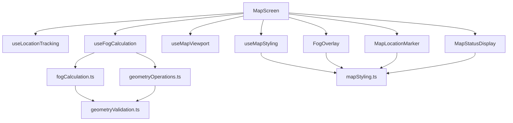

# Design Document

## Overview

This design outlines the refactoring of the monolithic `map.tsx` file into a modular architecture with separated concerns. The refactoring will extract geometry operations, fog calculations, styling utilities, UI components, and state management into focused modules while maintaining all existing functionality and performance characteristics.

## Architecture

### High-Level Component Structure

```
app/(tabs)/map.tsx (Main MapScreen - ~150 lines)
├── components/
│   ├── MapLocationMarker.tsx (Location marker component)
│   ├── MapStatusDisplay.tsx (Status and controls UI)
│   └── FogOverlay.tsx (Fog rendering component)
├── hooks/
│   ├── useFogCalculation.ts (Fog state management)
│   ├── useMapViewport.ts (Viewport bounds management)
│   └── useMapStyling.ts (Theme-aware styling)
└── utils/
    ├── geometryValidation.ts (Geometry validation utilities)
    ├── geometryOperations.ts (Turf.js wrapper utilities)
    ├── fogCalculation.ts (Fog calculation logic)
    └── mapStyling.ts (Map and fog styling utilities)
```

### Data Flow Architecture



## Components and Interfaces

### 1. Main MapScreen Component

**Responsibility:** Orchestrate map rendering and coordinate between child components and hooks.

**Interface:**
```typescript
// Simplified main component focusing on coordination
const MapScreen: React.FC = () => {
  // Core hooks for state management
  const { location, errorMsg } = useLocationTracking();
  const { fogGeoJSON, updateFogForLocation } = useFogCalculation();
  const { viewportBounds, updateViewportBounds } = useMapViewport();
  const { mapStyle, fogStyling, cycleMapStyle } = useMapStyling();
  
  // Render coordination only
  return (
    <View style={styles.container}>
      <MapboxGL.MapView>
        <MapLocationMarker location={location} />
        <FogOverlay fogGeoJSON={fogGeoJSON} styling={fogStyling} />
      </MapboxGL.MapView>
      <MapStatusDisplay 
        location={location}
        errorMsg={errorMsg}
        mapStyle={mapStyle}
        onStyleChange={cycleMapStyle}
      />
    </View>
  );
};
```

### 2. MapLocationMarker Component

**Responsibility:** Render the current location marker with theme-aware styling.

**Interface:**
```typescript
interface MapLocationMarkerProps {
  location: LocationObject | null;
  colorScheme?: 'light' | 'dark';
}

const MapLocationMarker: React.FC<MapLocationMarkerProps> = ({
  location,
  colorScheme
}) => {
  const markerStyling = useLocationMarkerStyling(colorScheme);
  
  if (!location) return null;
  
  return (
    <MapboxGL.PointAnnotation
      id="currentLocation"
      coordinate={[location.coords.longitude, location.coords.latitude]}
    >
      <LocationMarkerView styling={markerStyling} heading={location.coords.heading} />
    </MapboxGL.PointAnnotation>
  );
};
```

### 3. FogOverlay Component

**Responsibility:** Render fog overlay with proper styling and error handling.

**Interface:**
```typescript
interface FogOverlayProps {
  fogGeoJSON: FeatureCollection<Polygon | MultiPolygon>;
  styling: FogStyling;
}

const FogOverlay: React.FC<FogOverlayProps> = ({ fogGeoJSON, styling }) => {
  return (
    <MapboxGL.ShapeSource id="fogSource" shape={fogGeoJSON}>
      <MapboxGL.FillLayer
        id="fogLayer"
        sourceID="fogSource"
        style={styling.fill}
      />
      <MapboxGL.LineLayer
        id="fogEdgeLayer"
        sourceID="fogSource"
        style={styling.edge}
      />
    </MapboxGL.ShapeSource>
  );
};
```

### 4. MapStatusDisplay Component

**Responsibility:** Display location status, map style info, and controls.

**Interface:**
```typescript
interface MapStatusDisplayProps {
  location: LocationObject | null;
  errorMsg: string | null;
  mapStyle: string;
  onStyleChange: () => void;
}

const MapStatusDisplay: React.FC<MapStatusDisplayProps> = ({
  location,
  errorMsg,
  mapStyle,
  onStyleChange
}) => {
  const statusText = getStatusText(location, errorMsg);
  const mapStyleName = getMapStyleName(mapStyle);
  
  return (
    <ThemedView style={styles.statusContainer}>
      <ThemedText style={styles.statusText}>{statusText}</ThemedText>
      <ThemedText style={styles.mapStyleText}>Map Style: {mapStyleName}</ThemedText>
      <ThemedText style={styles.styleButton} onPress={onStyleChange}>
        Tap to change map style
      </ThemedText>
      <ThemedText style={styles.zoomHint}>
        Pinch to zoom • Pan to explore • Fog adapts to viewport
      </ThemedText>
    </ThemedView>
  );
};
```

## Data Models

### Geometry Types

```typescript
// Enhanced type definitions for geometry operations
export type RevealedArea = Feature<Polygon | MultiPolygon, GeoJsonProperties>;

export interface GeometryComplexity {
  totalVertices: number;
  ringCount: number;
  maxRingVertices: number;
  averageRingVertices: number;
  complexityLevel: 'LOW' | 'MEDIUM' | 'HIGH';
}

export interface GeometryValidationResult {
  isValid: boolean;
  errors: string[];
  warnings: string[];
  complexity?: GeometryComplexity;
}
```

### Fog Calculation Types

```typescript
export interface FogCalculationOptions {
  viewportBounds?: [number, number, number, number];
  bufferDistance: number;
  useViewportOptimization: boolean;
  performanceMode: 'fast' | 'accurate';
}

export interface FogCalculationResult {
  fogGeoJSON: FeatureCollection<Polygon | MultiPolygon>;
  calculationTime: number;
  performanceMetrics: {
    geometryComplexity: GeometryComplexity;
    operationType: 'viewport' | 'world';
    hadErrors: boolean;
  };
}
```

### Styling Types

```typescript
export interface FogStyling {
  fill: {
    fillColor: string;
    fillOpacity: number;
  };
  edge: {
    lineColor: string;
    lineOpacity: number;
    lineWidth: number;
    lineBlur: number;
  };
}

export interface LocationMarkerStyling {
  container: ViewStyle;
  core: ViewStyle;
  shadow: {
    shadowColor: string;
    shadowOffset: { width: number; height: number };
    shadowOpacity: number;
    shadowRadius: number;
    elevation: number;
  };
}
```

## Error Handling

### Geometry Operation Error Handling

```typescript
// Robust error handling with fallback strategies
export class GeometryOperationError extends Error {
  constructor(
    message: string,
    public operation: string,
    public geometryType?: string,
    public fallbackUsed?: boolean
  ) {
    super(message);
    this.name = 'GeometryOperationError';
  }
}

// Error handling strategy
const handleGeometryError = (
  error: GeometryOperationError,
  fallbackGeometry: Feature<Polygon | MultiPolygon>
): Feature<Polygon | MultiPolygon> => {
  logger.error(`Geometry operation failed: ${error.operation}`, error);
  
  // Log fallback usage
  logger.warn(`Using fallback geometry for ${error.operation}`);
  
  return fallbackGeometry;
};
```

### Fog Calculation Error Recovery

```typescript
// Progressive fallback strategy for fog calculation
export const createFogWithFallback = (
  revealedAreas: RevealedArea | null,
  options: FogCalculationOptions
): FogCalculationResult => {
  try {
    // Primary: Viewport-based fog with revealed areas
    return calculateViewportFog(revealedAreas, options);
  } catch (error) {
    logger.warn('Viewport fog calculation failed, trying simplified approach');
    
    try {
      // Secondary: Simplified viewport fog
      return calculateSimplifiedFog(options.viewportBounds);
    } catch (fallbackError) {
      logger.error('All fog calculation methods failed, using world fog');
      
      // Tertiary: World fog as final fallback
      return {
        fogGeoJSON: createWorldFogCollection(),
        calculationTime: 0,
        performanceMetrics: {
          geometryComplexity: { totalVertices: 5, ringCount: 1, maxRingVertices: 5, averageRingVertices: 5, complexityLevel: 'LOW' },
          operationType: 'world',
          hadErrors: true
        }
      };
    }
  }
};
```

## Testing Strategy

### Unit Testing Approach

1. **Geometry Utilities Testing**
   - Test validation functions with various invalid geometries
   - Test sanitization with malformed coordinates
   - Test union operations with complex polygons
   - Performance testing with large datasets

2. **Fog Calculation Testing**
   - Test viewport-based calculations with different bounds
   - Test error handling and fallback strategies
   - Test performance with complex revealed areas
   - Test debouncing behavior

3. **Component Testing**
   - Test MapLocationMarker with different location states
   - Test FogOverlay with various fog geometries
   - Test MapStatusDisplay with different status states
   - Test theme-aware styling

4. **Hook Testing**
   - Test useFogCalculation state management
   - Test useMapViewport bounds calculation
   - Test useMapStyling theme switching
   - Test cleanup and memory management

### Integration Testing

1. **Map Interaction Testing**
   - Test fog updates during map panning/zooming
   - Test location marker updates with GPS changes
   - Test style switching with fog appearance
   - Test performance under heavy interaction

2. **Error Scenario Testing**
   - Test behavior with invalid geometry data
   - Test fallback strategies under error conditions
   - Test recovery from geometry operation failures
   - Test graceful degradation

### Performance Testing

1. **Geometry Operation Performance**
   - Benchmark union operations with large polygon sets
   - Test difference operations with complex geometries
   - Monitor memory usage during calculations
   - Test viewport filtering efficiency

2. **Rendering Performance**
   - Test fog rendering with complex geometries
   - Monitor frame rates during map interactions
   - Test memory usage with large revealed areas
   - Benchmark component re-render frequency

## Implementation Notes

### Migration Strategy

1. **Phase 1:** Extract utility functions (geometry, fog calculation)
2. **Phase 2:** Create custom hooks for state management
3. **Phase 3:** Extract UI components (marker, status, fog overlay)
4. **Phase 4:** Refactor main MapScreen to use extracted modules
5. **Phase 5:** Add comprehensive testing and performance monitoring

### Performance Considerations

- Maintain viewport-based optimization for fog calculations
- Preserve debouncing mechanisms for map interactions
- Ensure geometry operations remain efficient
- Monitor memory usage during refactoring
- Maintain lazy loading where applicable

### Backward Compatibility

- All existing functionality must be preserved
- Performance characteristics should not degrade
- Error handling behavior should remain consistent
- Logging and debugging capabilities should be maintained